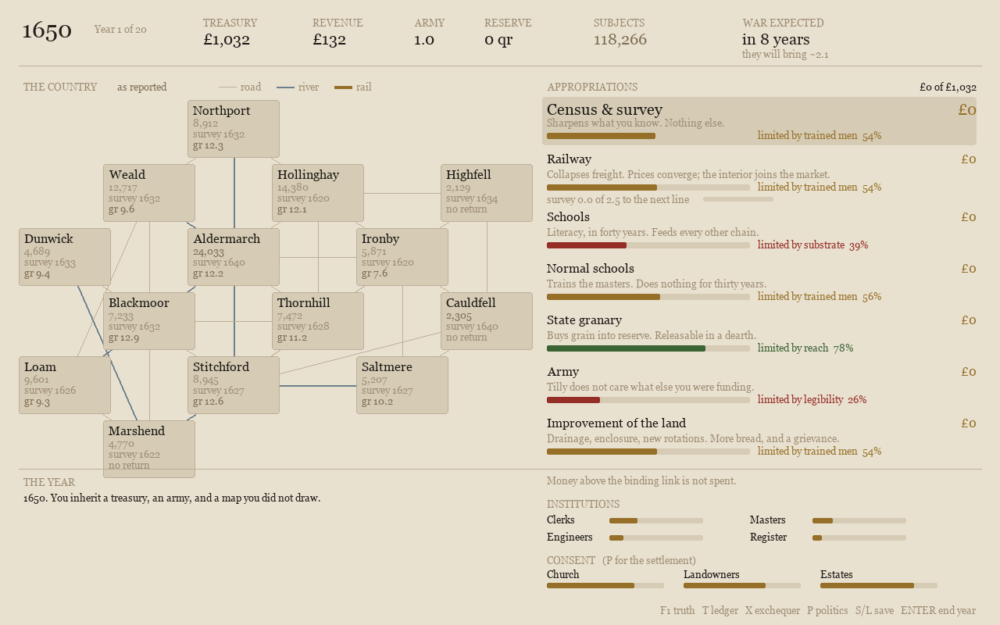

# Paper Sovereign

A government that cannot see its own country.

You govern fourteen provinces for twenty years, starting in 1650. You choose what to fund, but schools need teachers, armies need muster rolls, and the institutions that supply them have interests of their own. Your population counts and price reports arrive late and can be wrong.



## Play

Use Python 3.10 or newer and a desktop environment. This snapshot was checked on macOS with Python 3.14.8 and pygame-ce 2.5.8.

```sh
python3 -m venv .venv
.venv/bin/python -m pip install -r requirements.txt
./play.sh
```

| Control | Action |
|---|---|
| Up / Down | Select a budget line |
| Left / Right | Change its funding; hold Shift for larger steps |
| Enter | Begin the game or end the year |
| Click a province | Read its reports and price history |
| T | Compare provinces in the ledger |
| P | Negotiate with institutions |
| X | Set taxes |
| F1 | Compare the state's beliefs with the simulation's true values |
| S / L | Save or load `save.json` |
| Escape | Close a panel or quit |

The [opening screen](docs/images/opening.png) explains the premise. A run ends after twenty years with an account of the state you built and what it still does not know.

## What the simulation does

The state holds dated observations of population, prices, and unrest. A separate simulation tracks the underlying values. Spending on a census changes the quality and reach of those observations; it also changes which taxes and institutions the state can support.

Each budget line depends on a delivery chain. Its weakest link limits how much of an appropriation gets spent. Goods have stocks, production responds to prices, and a transport graph makes roads, rivers, ports, and railways matter to freight costs. Institutional consent can block an otherwise funded policy.

The documentation check remeasures these examples:

- At the start, you are wrong by about 16% about your population. F1 shows the discrepancy.
- Three provinces have no price return: Marshend, Cauldfell, Highfell. Under the tested balanced allocation, **Highfell** is the one you lose first across all eight tested seeds.
- Appropriate £60 for schools in year one and £24 gets spent: there is no press in the province to print
  a primer. The budget panel reports the limiting link.
- The tested all-army strategy keeps all fourteen provinces and ends broke, with about £198 and 20.9% literacy.
- In the fixed-budget comparison, railway investment cuts grain price dispersion from 3.76x to 1.67x. The checks require railway links to have been built as well as prices to have converged.

These are results of this fictional model and its test scenarios, not historical estimates.

## Code and checks

`game/sim.py` contains the simulation and uses only the Python standard library. `game/graph.py` implements the transport network. `game/main.py` is the pygame interface. The other modules check mechanisms, extreme strategies, reachable content, real input handlers, saved games, rendering, documentation claims, and scaling.

```sh
./verify.sh
./verify.sh --mutations
```

Both commands run in disposable copies. They leave your saved game and source files alone. The default command runs seven existing checks; the optional mutation run injects twelve known regressions and reports which ones the suite detects. To inspect a particular check, its source and module entry point are in `game/`.

The [packaging verification record](VERIFICATION.md) includes the local results and the checks that were not run.

## Scope

This is a playable prototype with a fixed map and twenty annual turns. The pairwise market calculation grows roughly quadratically, so the current implementation is not suitable for the larger maps contemplated during development. Heavy land-improvement spending can pin unrest at its maximum; the regression suite records that unresolved behavior explicitly.

See the short notes on [the economy](docs/economy.md), [scaling](docs/engine-choice.md), and [verification](docs/BUILD-LOG.md). [Provenance](PROVENANCE.md) records the package's origin and adaptations. Rights are reserved under [NOTICE](NOTICE).
